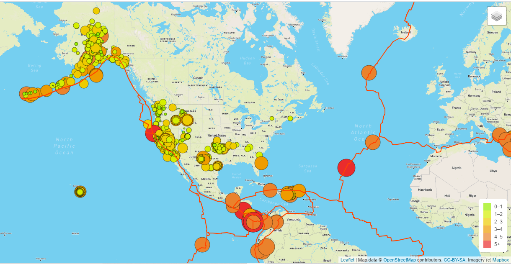
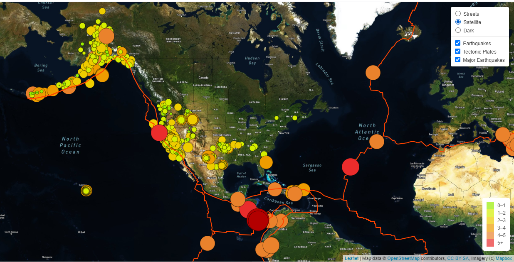
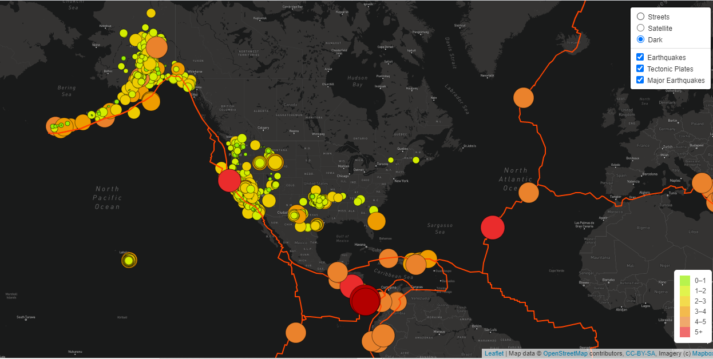

# Mapping_Earthquakes

## Overview of the analysis

An insightful data visualizations with interactive features on earthquakes from around the world will be created for a on-profit company that provides data driven story on disasters around the world.  The website and mobile application development will use the latest earthquake GeoJSON data from the US geological survey websites. The earthquake data will be traversed and retrieved using Javascirpt, D3 and Leaflet libraries and data plotted on a Mapbox map on an API request.<br />

The three technical deliverables required to complete Earthquake_Challenge analysis include <br />

1. Add Tectonic Plate Data
2. Add Major Earthquake Data
3. Add an Additional Map

## Resources
- Data Source: This analysis was performed using the [U.S. Geological Survey](https://earthquake.usgs.gov/earthquakes/feed/v1.0/summary/4.5_week.geojson) and [fraxen/tectonicplates](https://raw.githubusercontent.com/fraxen/tectonicplates/master/GeoJSON/PB2002_boundaries.json) datasets.
-  Code: [challenge_logic.js](https://github.com/aobasuyi/Mapping_Earthquakes/blob/main/Earthquake_Challenge/static/js/challenge_logic.js) and [index.html](https://github.com/aobasuyi/Mapping_Earthquakes/blob/main/Earthquake_Challenge/index.html)
- Data Tools: JavaScript, JSON, GeoJSON and IO (Web Server)
- Software: ES6, Javascript;  Visual Studio Code, 1.56

## Results

### Deliverable 1
#### Add Tectonic Plate Data <br />
- Using the knowledge of JavaScript, Leaflet.js, and geoJSON data, add tectonic plate data using d3.json(), add the data using the geoJSON() layer, set the tectonic plate LineString data to stand out on the map, and add the tectonic plate data to the overlay object with the earthquake data.

##### Code and Image

```
// 1. Add a 2nd layer group for the tectonic plate data.
let allEarthquakes = new L.LayerGroup();
let tectonicPlates = new L.LayerGroup();

// 2. Add a reference to the tectonic plates group to the overlays object.
let overlays = {
  "Earthquakes": allEarthquakes,
  "Tectonic Plates" : tectonicPlates,
};

// Then add a control to the map that will allow the user to change which layers are visible.
L.control.layers(baseMaps, overlays).addTo(map);

// 3. Use d3.json to make a call to get our Tectonic Plate geoJSON data.
  d3.json("https://raw.githubusercontent.com/fraxen/tectonicplates/master/GeoJSON/PB2002_boundaries.json").then(function(pData) {
    // Adding our geoJSON data and style information to the tectonicplates layer.
        L.geoJson(pData, {
        color: "#ff4400",
        weight: 2      
        
  }).addTo(tectonicPlates);
 
  });
   // Add the tectonic plates layer to the map
   tectonicPlates.addTo(map);
});

```

<br />  <br />

### Deliverable 2
#### Add Major Earthquake Data <br />
- Using the knowledge of JavaScript, Leaflet.js, and geoJSON data, add major earthquake data to the map using d3.json(), add a color and set the radius of the circle based on the magnitude of earthquake. As well, add a popup marker for each earthquake that displays the magnitude and location of the earthquake using the GeoJSON layer, geoJSON().

##### Code and Image

```
// 1. Add a 2nd layer group for the tectonic plate data.
let allEarthquakes = new L.LayerGroup();
let tectonicPlates = new L.LayerGroup();
let majorEQ = new L.LayerGroup();

// 2. Add a reference to the tectonic plates group to the overlays object.
let overlays = {
  "Earthquakes": allEarthquakes,
  "Tectonic Plates" : tectonicPlates,
  "Major Earthquakes" : majorEQ,
};

// 3. Retrieve the major earthquake GeoJSON data >4.5 mag for the week.
  d3.json("https://earthquake.usgs.gov/earthquakes/feed/v1.0/summary/4.5_week.geojson").then(function(data) {

// 4. Use the same style as the earthquake data.
// This function returns the style data for each of the earthquakes we plot on tha map
// We pass the magnitude of the earthquake into two separate functions to calculate teh color and radius.
    function styleInfo(feature) {
    return {
      opacity: 1,
      fillOpacity: 1,
      fillColor: getColor(feature.properties.mag),
      color: "#000000",
      radius: getRadius(feature.properties.mag),
      stroke: true,
      weight: 0.5
    };
  }  
// 5. Change the color function to use three colors for the major earthquakes based on the magnitude of the earthquake.
// This function determines the color of the marker based on the magnitude of the earthquake.
  function getColor(magnitude) {
    if (magnitude > 6) {
      return "#b30000";
    }
    if (magnitude > 5) {
      return "#ea2c2c";
    }
    if (magnitude < 5) {
      return "#ea822c";
    }
    
  }
  
// 6. Use the function that determines the radius of the earthquake marker based on its magnitude.
// This function determines the radius of the earthquake marker based on its magnitude.
// Earthquakes with a magnitude of 0 were being plotted with the wrong radius.
  function getRadius(magnitude) {
    if (magnitude === 0) {
      return 1;
    }
    return magnitude * 4;
  }
  
// 7. Creating a GeoJSON layer with the retrieved data that adds a circle to the map 
// sets the style of the circle, and displays the magnitude and location of the earthquake
//  after the marker has been created and styled.
  
  L.geoJson(data, {
    // We turn each feature into a circleMarker on the map.
    pointToLayer: function(feature, latlng) {
        console.log(data);
        return L.circleMarker(latlng);
      },
    // We set the style for each circleMarker using our styleInfo function.
  style: styleInfo,
   // We create a popup for each circleMarker to display the magnitude and location of the earthquake
   //  after the marker has been created and styled.
   onEachFeature: function(feature, layer) {
    layer.bindPopup("Magnitude: " + feature.properties.mag + "<br>Location: " + feature.properties.place);
  }
}).addTo(majorEQ);

// 8. Add the major earthquakes layer to the map.
majorEQ.addTo(map);

// 9. Close the braces and parentheses for the major earthquake data.
});

```

<br />  <br />

### Deliverable 3
#### Add an Additional Map <br />
- Using your knowledge of JavaScript and Leaflet.js add a third map style to your earthquake map.

##### Code and Image

```
// We create the tile layer that will be the background of our map.
let streets = L.tileLayer('https://api.mapbox.com/styles/v1/mapbox/streets-v11/tiles/{z}/{x}/{y}?access_token={accessToken}', {
	attribution: 'Map data &copy; <a href="https://www.openstreetmap.org/">OpenStreetMap</a> contributors, <a href="https://creativecommons.org/licenses/by-sa/2.0/">CC-BY-SA</a>, Imagery (c) <a href="https://www.mapbox.com/">Mapbox</a>',
	maxZoom: 18,
	accessToken: API_KEY
});

// We create the second tile layer that will be the background of our map.
let satelliteStreets = L.tileLayer('https://api.mapbox.com/styles/v1/mapbox/satellite-streets-v11/tiles/{z}/{x}/{y}?access_token={accessToken}', {
	attribution: 'Map data &copy; <a href="https://www.openstreetmap.org/">OpenStreetMap</a> contributors, <a href="https://creativecommons.org/licenses/by-sa/2.0/">CC-BY-SA</a>, Imagery (c) <a href="https://www.mapbox.com/">Mapbox</a>',
	maxZoom: 18,
	accessToken: API_KEY
});

// We create the dark view tile layer that will be an option for our map.
let dark = L.tileLayer('https://api.mapbox.com/styles/v1/mapbox/dark-v10/tiles/{z}/{x}/{y}?access_token={accessToken}', {
attribution: 'Map data © <a href="https://www.openstreetmap.org/">OpenStreetMap</a> contributors, <a href="https://creativecommons.org/licenses/by-sa/2.0/">CC-BY-SA</a>, Imagery (c) <a href="https://www.mapbox.com/">Mapbox</a>',
    maxZoom: 18,
    accessToken: API_KEY
});

```

<br />  <br />


